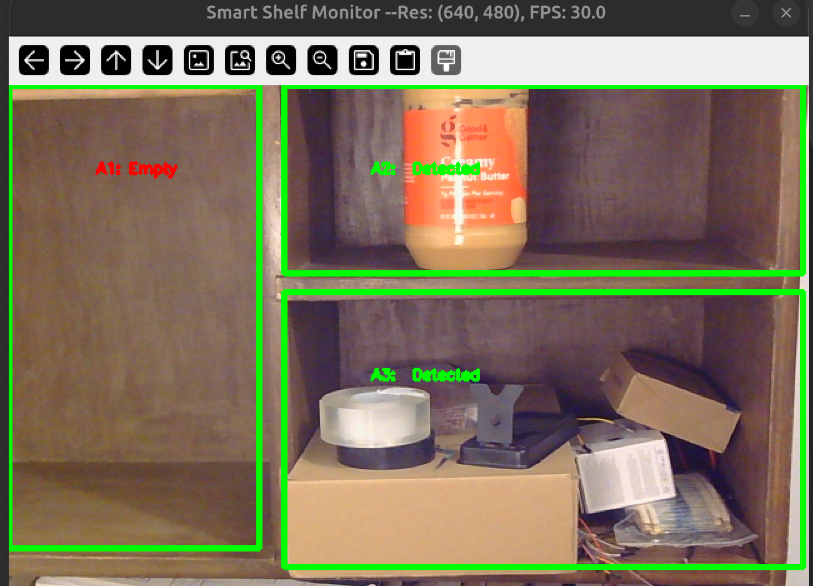

# Edge Vision Inspection System

A real-time computer vision inspection prototype for detecting object presence across predefined shelf slots using OpenCV, Python, and camera input.

The final version of this project will be a camera-based smart shelf inspection system that can monitor multiple shelf slots in real time and automatically report the condition of each slot. For each slot, the system will determine whether the slot is empty, occupied, low-stock, or potentially misplaced. The goal is to create an edge-deployable inspection system that can support inventory monitoring, restocking decisions, and visual shelf-status tracking without requiring manual checking.

The current version uses manually defined shelf slots, OpenCV image preprocessing, Canny edge detection, and threshold-based classification.

---

## v0.6 Demo — Multi-Slot Object Detection

[](assets/videos/)

**Figure 1. v0.4/0.5 multi-slot object detection demo.**  
The system detects object presence across multiple predefined shelf regions. In this output, slot **A1** is classified as empty, while **A2** and **A3** are detected as occupied. The display also shows the rendered resolution and camera FPS.

_Click the image above to open the  video demos._

---

## Current Status

## Current Status

**Current Development Version:** v0.5  
**Stable Released Version:** v0.4  
**Status:** In Progress  
**Current capability:** Config-based multi-slot object presence detection using predefined shelf regions.

The latest development version builds on the stable v0.4 multi-slot detection system. In v0.5, shelf slot coordinates and detection thresholds are moved out of the Python source code and into a YAML configuration file.

The system currently can:

- Open a live camera or video stream.
- Display real-time video output.
- Draw multiple predefined shelf slot regions on the frame.
- Load slot definitions from `configs/shelf_slots.yaml`.
- Load per-slot detection thresholds from `configs/shelf_slots.yaml`.
- Analyze each slot independently.
- Classify each slot as empty or detected/occupied.
- Display slot labels and detection status directly on the video frame.
- Show rendered resolution and FPS in the display window title.
- Preserve the same detection behavior as v0.4 while making the system easier to configure and scale.

v0.5 testing compares the config-based implementation against the v0.4 baseline. Test notes are stored in:

```text
data/evidence/v0.5_test_notes.md
---
```

## Project Goal

The goal of this project is to build a real-time inspection system that can run on edge hardware such as an NVIDIA Jetson with a USB camera.

The long-term direction is to move from manually defined shelf slots toward a more automated shelf monitoring system that can support:

- Empty slot detection
- Object presence detection
- Low-stock monitoring
- Misplaced item detection
- Camera-based inventory inspection
- Edge deployment on Jetson hardware

---

## Hardware Used

- NVIDIA Jetson Orin Nano
- Logitech USB camera
- Ubuntu/Linux development environment

Development and testing may also be performed on a regular Ubuntu PC before deploying to the Jetson.

---

## Software Stack

- Python
- OpenCV
- Linux
- Git/GitHub
- Virtual environment
- Camera/video input processing

---

## Project Structure

```text
Edge-Vision-Inspection-System/
│
├── assets/
│   ├── diagrams/
│   ├── pictures/
│   │   └── object_detection_in_multiple_slots.png
│   └── videos/
│       ├── v0.3: Occupancy Detection Demo.mp4
│       └── v0.4 : Oobject_detection_in_multiple_slots.mp4
│
├── configs/
│
├── data/
│   ├── evidence/
│   ├── images/
│   └── logs/
│
├── src/
│   ├── camera.py
│   ├── main.py
│   └── shelf_config.py
│
├── tests/
│
├── .gitignore
├── README.md
└── requirements.txt
