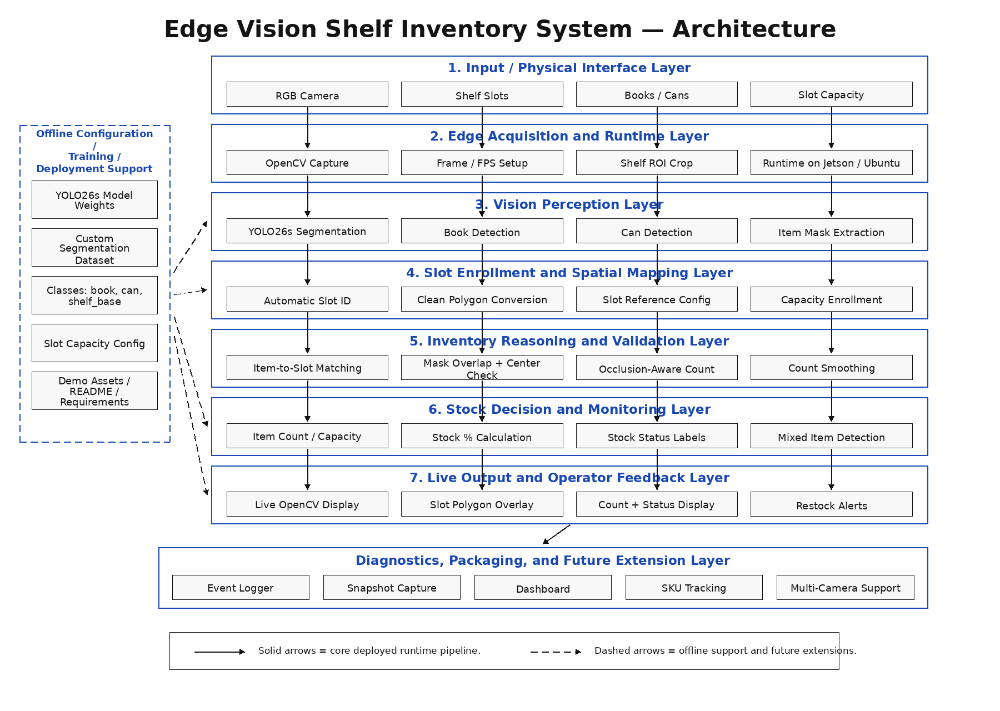

# Real-time Stock Monitoring with YOLO Segmentation (EDGE AI)


A camera-only shelf inventory monitoring prototype built with YOLO26s instance segmentation, OpenCV, and a live RGB camera feed.

The system detects shelf slots, maps them with clean polygons, detects visible items, counts products per slot, compares the count against enrolled slot capacity, and displays real-time stock status. It does this without using a depth camera, RFID tags, weight sensors, or smart shelf hardware.

[](assets/)

<p align="center"><em>Click on the architecture diagram to watch the demo videos.</em></p>


## What It Does

* Detects shelf slots
* Converts shelf regions into clean slot polygons
* Detects books and cans using YOLO26s segmentation
* Assigns detected items to the correct shelf slot
* Counts visible items per slot
* Calculates stock level using item count and enrolled slot capacity
* Detects mixed-item placement
* Smooths item counts to reduce flickering
* Shows live stock status with OpenCV overlays

## Why This Project Matters

Many shelf inventory systems depend on extra hardware such as depth cameras, RFID tags, smart shelves, or weight sensors.

This project explores a cheaper approach: using a regular RGB camera with computer vision. It is not a finished commercial product, but it shows how a camera-only edge vision system can estimate shelf-level inventory status.

## Stock Status Labels

| Stock Level | Status                      |
| ----------- | --------------------------- |
| 0–20%       | Empty / Need Restock ASAP   |
| 20–50%      | Low Stock / Restock Soon    |
| 50–75%      | Partial / Light Restocking  |
| 75–93%      | Almost Full / No Restocking |
| 93–100%     | Full / No Restocking        |

## Model

The project uses a custom YOLO26s instance segmentation model trained for:

* book
* can
* shelf_base

The dataset was built from 200 labeled shelf images and expanded using 3x augmentation. The augmentation included brightness, blur, grains and exposure variation to help the model handle different lighting conditions during live camera testing.

Segmentation is used for visible item detection, slot matching, and partial visibility cases where products may block each other.

## Model Evaluation Metrics

The YOLO26s instance segmentation model was trained for 100 epochs on a custom shelf dataset.

Final evaluation metrics:

| Metric Type       | Precision | Recall |  mAP50 | mAP50-95 |
| ----------------- | --------: | -----: | -----: | -------: |
| Bounding Box      |    89.97% | 92.25% | 93.36% |   84.13% |
| Segmentation Mask |    88.01% | 90.16% | 90.16% |   66.02% |

This project was trained as an instance segmentation model. YOLO reports bounding-box metrics automatically because every segmentation mask also has an outer box. The inventory system mainly uses segmentation masks for visible item detection, slot assignment, and partial-visibility reasoning.

Training plots and result files are available here:

* [Model results](assets/model_results/)
* [Training curves](assets/model_results/results.png)
* [Confusion matrix](assets/model_results/confusion_matrix.png)
* [Normalized confusion matrix](assets/model_results/confusion_matrix_normalized.png)

## Setup

Create and activate a virtual environment:

```bash
python3 -m venv .venv
source .venv/bin/activate
```

Install dependencies:

```bash
pip install -r requirements.txt
pip install -e .
```

## Running the Project

Enroll shelf slots:

```bash
python3 tools/enroll_shelf_base.py
```

Enroll maximum item capacity for each slot:

```bash
python3 tools/enroll_slot_capacity.py
```

Run live shelf monitoring:

```bash
python3 tools/live_stock_level_test.py
```


## Notes

The system estimates stock level from visible detections. A single camera cannot guarantee the count of fully hidden items.

For v1.0, the goal was to build a working prototype that connects computer vision detections to practical inventory decisions.
